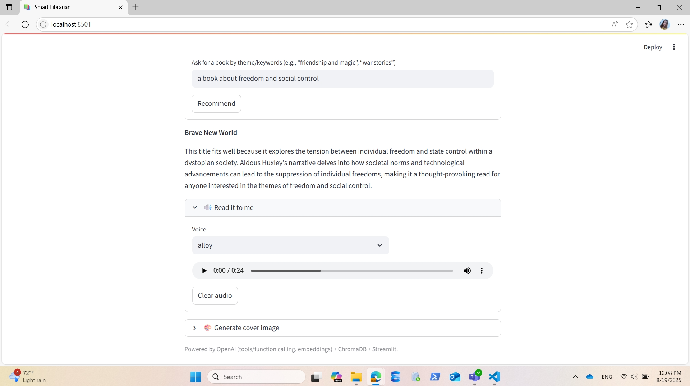

# Smart Librarian – Project Documentation

> Purpose: a living document that explains the assignment, tech choices, environment setup, and the codebase step‑by‑step.


## 1) Project Brief & Full Requirements

### Goal

Build a “Smart Librarian” AI assistant that recommends books based on a user’s interests using **RAG (Retrieval‑Augmented Generation)** with a local **vector store** (e.g., ChromaDB) and **OpenAI GPT**. After recommending a book, the app should automatically fetch and display a **detailed summary** using a custom tool/function.

### Mandatory Requirements

1. **Book summaries dataset**

   * Create a `book_summaries` data source with **≥10 books**.
   * For each book: `title`, a **short summary** (3–5 lines), and **themes** (e.g., friendship, adventure, war).
2. **Vector store (NOT OpenAI’s vector store)**

   * Load the dataset into a local vector database (e.g., **ChromaDB**).
   * Create embeddings using **OpenAI embeddings** (e.g., `text-embedding-3-small`).
   * Implement a **retriever** that supports **semantic search by theme/context**.
3. **Chatbot (CLI or Streamlit UI)**

   * Accept queries such as “I want a book about friendship and magic” or “What do you recommend for someone who loves war stories?”.
   * Use the retriever (RAG) to find matches in the vector store.
   * Respond conversationally with **a recommended title**.
4. **Tool: `get_summary_by_title(title: str)`**

   * A Python function that returns the **full summary** for an exact book title (from a local dict/JSON/etc.).
   * Register this function as a **tool/function** for the model.
   * After the LLM recommends a title, **automatically call the tool** and display the full summary.

### Optional Enhancements

5. **Profanity filter**: if user input contains offensive words, respond politely and **do not forward** the prompt to the LLM.
6. **Text‑to‑Speech (TTS)**: allow users to listen to the recommendation + summary.
7. **Speech‑to‑Text (STT)**: allow voice input; transcribe and use as the user query.
8. **Image generation**: generate a cover‑style image for the recommended book.
9. **Frontend beyond Streamlit (optional)**: build a web UI (React/Vue/Angular) that talks to a Python backend if desired.

### Deliverables

* `book_summaries` file with **10+ books**.
* Source code including:

  * Vector store initialization + ingestion.
  * `get_summary_by_title()` tool.
  * Chat flow (LLM + RAG + tool calling).
  * UI (CLI or Streamlit minimal UI at least).
* `README.md` with build/run steps.
* Example test questions (e.g., “A book about freedom and social control”, “What do you recommend if I love fantasy stories?”, “What is *1984*?”).

> Notes from the assignment: focus on understanding the RAG + tool‑calling flow. If you must use OpenAI’s vector store, document why and what you tried. Formats are flexible; use Copilot/ChatGPT to assist if needed.


## 2) Technologies Used & Why

* **Python 3.11+**: modern, stable; great ecosystem for ML + data tooling.
* **OpenAI Python SDK**: embeddings, chat models, tools/function calling, TTS/STT, images - all in one API.
* **ChromaDB** (local vector store): lightweight, fast to set up, files on disk - ideal for a homework/demo RAG system.
* **Streamlit**: quickest way to ship a working UI with forms, audio inputs, and media playback.
* **python‑dotenv**: easy management of secrets and config (`.env` with `OPENAI_API_KEY`).

> Optional utilities I might add later: Pillow (image post‑processing), pydub/soundfile (audio conversions).


## 3) Environment Setup & Security Constraints (What Happened & Resolution)

### Issue Encountered

* On the work computer, direct `pip install` was blocked by security policies.

### Resolution

* Created a **local virtual environment** inside the project and executed commands with the environment’s **`python.exe`** and `pip`.
* After isolating the environment, installations proceeded without issues.
* Used **Git Bash** as the terminal for the project.

### Practical Steps (Windows + Git Bash)

1. **Created project & venv**

   ```bash
   mkdir smart-librarian && cd smart-librarian
   python -m venv .venv
   # Activate the venv (Git Bash)
   source .venv/Scripts/activate
   ```
2. **Verified I'm using the venv’s Python**

   ```bash
   which python
   # Should point to .../smart-librarian/.venv/Scripts/python
   ```
3. **(If activation is restricted) Run installs via the venv’s python.exe directly**

   ```bash
   .venv/Scripts/python.exe -m pip install --upgrade pip
   .venv/Scripts/python.exe -m pip install openai chromadb streamlit python-dotenv
   ```
4. **Created a `.env` file**

   ```env
   OPENAI_API_KEY=sk-...
   ```

> Using the interpreter from `.venv/Scripts/python.exe` ensures all installs/executes happen in the isolated environment, bypassing most corporate restrictions.


## 4) Packages Installed (via Git Bash)

* `openai`
* `chromadb`
* `streamlit`
* `python-dotenv`

*(Optional later: `Pillow`, `soundfile`, `pydub` for image/audio utilities.)*


## 5) Data Preparation — `book_summaries.json`

Created a JSON file with **at least 10 books**, each having `title`, `summary`, and `themes` (list of keywords). Suggested path: `data/book_summaries.json`.

### Example structure

```json
[
  {
    "title": "1984",
    "summary": "A dystopia about surveillance, propaganda and control. Winston Smith seeks truth and freedom under Big Brother.",
    "themes": ["dystopia", "freedom", "control", "truth"]
  },
  {
    "title": "The Hobbit",
    "summary": "Bilbo joins dwarves to reclaim their treasure from Smaug and discovers unexpected courage and friendship.",
    "themes": ["friendship", "adventure", "heroism", "fantasy"]
  }
]
```

### Guidelines

* Kept summaries concise (3–5 lines) and included **clear themes**.
* Used **English** summaries for the best semantic retrieval with the chosen embedding model.
* We can add more metadata later if we need filtering (e.g., author, genre, year), but kept **metadata values primitive** for Chroma (strings, numbers, booleans).

## 6) Ingestion & Vector Store Initialization (ChromaDB)

### What is ChromaDB
**ChromaDB** is a lightweight, local **vector database** — a place to store text as **vectors** (embeddings) so we can perform **semantic search**. Instead of keyword matching, we convert text into numeric vectors using an **embedding model** (OpenAI `text-embedding-3-small`). Similar meanings end up close together in vector space, so we can retrieve the most relevant items for a user’s query.

**Why ChromaDB here?**
- **Local & simple**: no external infra, writes to a folder (`./chroma`).
- **Fast iteration**: perfect for a homework/demo RAG app.
- **Control over embeddings**: we compute embeddings with OpenAI and pass them into Chroma explicitly.

### Ingestion flow — how it works
1. **Loaded config & clients**: read `OPENAI_API_KEY` from `.env`; create an OpenAI client.
2. **Created/opened a persistent vector store**: `chromadb.PersistentClient(path="./chroma")` ensures data stays on disk between runs.
3. **Got (or created) a collection**: think of a collection as a table (here, `book_summaries`).
4. **Prepared documents**: for each book, built a text blob that includes title, summary, and themes (themes joined into a string). This is the text we’ll embed.
5. **Computed embeddings**: called OpenAI embeddings (`text-embedding-3-small`) for each document.
6. **Added to Chroma**: called `collection.add(ids=..., embeddings=..., documents=..., metadatas=...)`.
   - **Important**: Chroma metadata values must be **primitives** (`str`, `int`, `float`, `bool`, or `None`). Lists/dicts are not allowed, so we store `themes` as a comma-separated string.
7. **Persisted & printed**: Chroma writes to `./chroma`; the script prints how many books were indexed.

### Why this matters
- Embeddings capture **semantic meaning** of text.
- ChromaDB enables **fast similarity search** over those embeddings.
- This is the foundation for RAG: find relevant books given a natural language query.

### How to run
```bash
# From the project root
python backend/ingest.py
```

We should see: `Indexed 10 books into Chroma`. (or more, depending on the JSON). This creates/updates the ./chroma folder.

**Troubleshooting**
* **ValueError**: metadata must be primitive: ensure themes is a string (comma-separated), not a list.
* **Permission issues on Windows**: if schema changed, delete the ./chroma folder and re-run the script.
* **Embeddings quota/auth errors**: verify .env has OPENAI_API_KEY and that load_dotenv() runs before client usage.

## 7) Retriever API (Semantic Search over ChromaDB)

### What the retriever does
The retriever turns a **user query** (e.g., “friendship and magic”) into an **embedding** and asks ChromaDB for the **k most similar** documents (books) based on vector proximity. It returns a tidy list of **hits** you can feed to the chat/model layer.

### How it’s wired
- **Environment & clients**
  - Loads the API key from `.env` and initializes the OpenAI client.
  - Opens the same **persistent ChromaDB** path (`./chroma`) and the `book_summaries` collection populated during ingestion.
- **`embed_query(text)`**
  - Calls OpenAI embeddings (`text-embedding-3-small`) to convert the user’s natural language query into a vector.
- **`search_books(user_query: str, k: int = 3)`**
  1. Creates the **query embedding**.
  2. Calls `collection.query(...)` asking for the **top-k** nearest items.
  3. Requests: `documents`, `metadatas`, and `distances`.
  4. Normalizes the response into a list of dicts with `{title, themes, document, distance}`.

> **Distance intuition:** Chroma returns a numeric **distance** for each match. A **smaller** distance generally means a **closer semantic match** (i.e., more relevant).

### Code walkthrough (conceptual)
- **OpenAI client & Chroma collection**
  - Reuses the same collection name as ingestion (`book_summaries`) so we’re querying the exact vectors you indexed.
- **Embedding the query**
  - Uses the **same embedding model** as ingestion. Matching the model is important for consistent vector space alignment.
- **Querying Chroma**
  - `query_embeddings=[q_emb]`: we can pass multiple queries, but here we pass only one.
  - `n_results=k`: top-k items, default 3.
  - `include=["documents", "metadatas", "distances"]`: returns the human-readable text (`documents`), our side-car info (`metadatas`), and a score (`distances`).
- **Result shaping**
  - Chroma returns arrays shaped by the number of queries. Since we pass a single query, we take the **first** element from each (`[0]`).
  - We then `zip(...)` the parallel arrays and produce a list of **hits** ready for UI/LLM consumption.

### Example behavior
- Input: `user_query="friendship and magic", k=3`
- Output (conceptually):
  ```json
  [
    {
      "title": "Harry Potter and the Sorcerer's Stone",
      "themes": "friendship, magic, coming-of-age, good-vs-evil",
      "document": "Title: ...\nSummary: ...\nThemes: ...",
      "distance": 0.09
    },
    { "... second match ..." },
    { "... third match ..." }
  ]
  ```
- We typically pass the **top 1** title to your LLM to generate a conversational recommendation.

**Practical tips**

* **Keep models consistent**: use the **same embedding model** for ingestion and retrieval.
* **Metadata is primitive**: we flattened `themes` to a comma-separated string during ingestion; the retriever simply returns that string.
* **k (top-k)**: start with `k=3`. If our dataset grows, we should consider `k=5`–`k=10` and let the LLM choose among candidates.
* **Distance vs. similarity**: Chroma exposes distances; lower is better. If we need a “confidence”, we can convert distance to a heuristic score (e.g., `score = 1 / (1 + distance)`).
* **Filtering (optional)**: If we later encode themes as boolean flags in metadata (e.g., `theme_friendship=True`), we can add `where=...` to `collection.query(...) `to **combine semantic search with filters**.

**Minimal usage pattern (how other code calls it)**

* The UI/controller calls:

    ```python
    hits = search_books(user_query="friendship and magic", k=3)
    top_title = hits[0]["title"] if hits else None
    ```

* Then passes top_title and the original user request to the **chat/model** layer for the final recommendation, followed by a tool call for the full summary.
    ```python
    ::contentReference[oaicite:0]{index=0}
    ```

## 8) Tooling Layer — `get_summary_by_title` (tools.py)

### Purpose
After the model recommends a book, we want to **append the full summary** for that exact title. Rather than asking the model to hallucinate, we **call a local tool** (function) that looks up the authoritative summary from our dataset.

### How it works
1. **Load the dataset once**  
   On import, we open `data/book_summaries.json` and build an in-memory dictionary keyed by title:
   - Keys: exact book titles  
   - Values: the full JSON entries (so we can access `summary`, `themes`, etc.)

2. **Lookup function**
   - `get_summary_by_title(title: str) -> str` checks the dictionary and returns the **exact** book’s `summary`.
   - If the title doesn’t exist (typo, mismatch), it returns `"Summary not found."`.

### Why a “tool”?
- In the chat layer, we register this function as a **tool/function** so the LLM can request:  
  _“Call `get_summary_by_title` with `title='1984'`”_.  
  The app executes the function locally and then **injects the result into the UI**, ensuring **grounded** and **deterministic** summaries.

### Key points & good practices
- **Exact titles**: tool requires an exact match. This ensures deterministic behavior and avoids partial/ambiguous results.
- **Data locality**: the tool reads from our local JSON; it’s fast, offline-friendly, and avoids extra API usage.
- **Determinism**: no LLM guessing; we always show our curated summary.


## 9) Streamlit App — Orchestration, State, and UX (app.py)

### High-level responsibilities
- Provide a **chat-like UI** for recommendations.
- Perform **RAG retrieval** via `search_books(...)` and call the **LLM** to decide/justify the recommendation.
- Register and handle the **tool call** (`get_summary_by_title`) to append a full, grounded summary.
- Offer **TTS** (read the recommendation aloud), **STT** (speak a query), and **image generation** (cover concept).
- Manage UI **state** so buttons/players/images appear/disappear at the right time.


### 9.1 Environment & Clients
- Loads `OPENAI_API_KEY` with `dotenv`.
- Creates a single OpenAI client (`OpenAI(...)`) reused across features.
- Imports `search_books` (retriever) and `get_summary_by_title` (tool).


### 9.2 Streamlit page config
- Sets the page title/icon and renders a main header:
  - `st.set_page_config(page_title="Smart Librarian", page_icon="📚")`
  - `st.title("📚 Smart Librarian — RAG + Tools")`


### 9.3 Session State Initialization
The app **re-runs** on every user interaction, so persistent UI state lives in `st.session_state`. The `init_state()` helper creates defaults for:

- **Chat content**  
  - `chat_text`: the final text shown (recommendation + full summary)  
  - `final_title`: the selected/recommended title  
  - `last_query`: last typed/spoken query
- **TTS (Text-to-Speech)**  
  - `tts_audio`: bytes of generated audio  
  - `tts_fmt`: chosen audio format  
  - `tts_title`: for filenames, etc.  
  - `voice_select`, `fmt_select`: UI selections  
  - `tts_force_open`: auto-opens the expander when generating/ready
- **STT (Speech-to-Text)**  
  - `voice_transcript`: latest transcript text  
  - `prefill_query`: lets STT prefill the chat text input
- **Image generation**  
  - `cover_image`: bytes for the generated cover image  
  - `cover_prompt`: the last prompt used  
  - `cover_force_open`: auto-open behavior like TTS

> **Why:** Without session state, buttons would reappear or content would vanish on every rerun. This state model ensures a **predictable UX**.


### 9.4 Profanity Gate (optional)
- A small set `BAD_WORDS` lets you short-circuit sending inappropriate input to the LLM (we can expand or replace with a real moderation layer).


### 9.5 Tool Registration for the Model
`get_tool_spec()` returns a **tool schema** describing the function we allow the model to call:

- `"name": "get_summary_by_title"` and a JSON schema for its parameters (`title`).
- We pass this to the model so it knows **how to ask** for the summary.

> Note: This app uses the **Responses API** with a top-level `name` (matching the current schema we implemented). The model can then choose `tool_choice="auto"` to call it when appropriate.

### 9.6 Orchestrating the Recommendation (`call_model_for_reco` + `handle_tool_calls`)

**A) Requesting the recommendation**
- `call_model_for_reco(user_query, top_hit_title)`:
  - Builds a **system prompt** (“helpful librarian”).
  - Puts the **user’s intent** and the **top candidate** (from the retriever) in the user message.
  - Calls the OpenAI **Responses** endpoint with:
    - `model="gpt-4o-mini"`
    - `tools=get_tool_spec()` (so the model can decide to call `get_summary_by_title`)
    - `tool_choice="auto"`

**B) Executing the tool call / assembling the final text**
- `handle_tool_calls(resp)`:
  - Iterates over the returned events:
    - Captures assistant’s natural-language output (the recommendation/explanation).
    - Detects a **tool call** for `get_summary_by_title`, extracts the `title`, executes the **local** Python function, and appends the **full summary** to the UI text.
  - Returns `(final_text, chosen_title)`.

> This pairing gives you: **(1)** a conversational recommendation and **(2)** an authoritative summary fetched from our dataset.

### 9.7 TTS (Text-to-Speech)
- `synthesize_tts_bytes(text, voice, fmt)`:
  - Calls the **Audio → Speech** API with `gpt-4o-mini-tts`.
  - Returns raw bytes (e.g., MP3) suitable for `st.audio`.
  - Cached via `@st.cache_data` to avoid regenerating the same audio.
- **UI behavior**
  - A “Read it to me” expander renders either:
    - **Generate audio** button (when no audio yet), or
    - The **audio player** (once ready), plus a **Clear audio** button.
  - Session state (`tts_audio`, `tts_force_open`) ensures:
    - The button disappears once audio exists.
    - The expander stays open after a rerun when generating/ready.
  - The **Generate** button is disabled until `chat_text` exists (prevents empty-input TTS).


### 9.8 STT (Speech-to-Text)
- `transcribe_uploaded_audio(uploaded, model="gpt-4o-mini-transcribe")`:
  - Saves the microphone capture (`st.audio_input`) to a temp file.
  - Sends the file to **Audio → Transcriptions** (supports `gpt-4o-mini-transcribe`, `gpt-4o-transcribe`, `whisper-1`).
  - Returns the `.text` transcript.
- **Voice Mode expander**
  - Lets users record, choose a model, and transcribe on click.
  - On success:
    - Stores `voice_transcript`.
    - Optionally **prefills** the main chat input (`prefill_query`) so users can immediately press **Recommend**.
  - Shows the transcript in a text area and a **Use transcript as query** button for convenience.


### 9.9 Chat Form & Submission Flow
- The main form contains a single text input bound to `query_text`.
- On **submit**:
  1. If the field is empty, show a **warning** (no unnecessary calls).
  2. Reset ephemeral state:
     - Clear TTS and Image state so old outputs do not persist into a new query.
  3. **RAG retrieval**: `hits = search_books(query, k=3)`
  4. If no hits → set `chat_text = "No matches found."`
  5. Else:
     - Take the **top** match’s title.
     - Call `call_model_for_reco(...)` → model may **call the tool** automatically.
     - `handle_tool_calls(...)` combines the assistant’s text + **full summary**.
     - Persist results to session state (`chat_text`, `final_title`) so they remain across reruns.


### 9.10 Rendering the Final Text
- Outside the submit block, render `st.session_state["chat_text"]` so it stays visible on every rerun.
- This is what TTS and Image features read from.

### 9.11 Image Generation (Cover Concept)
- `generate_cover_image(prompt, size="1024x1024")`:
  - Calls **Images** API with `gpt-image-1` and decodes the base64 PNG bytes.
- **UI behavior**
  - A “Generate cover image” expander:
    - Builds a **default prompt** using the `final_title` and the visible `chat_text` (first ~800 chars).
    - Lets users edit prompt, choose size + style hint.
    - **Generate button** disabled until `chat_text` exists.
    - Once an image is generated:
      - Displays it under the recommendation.
      - Hides the button.
      - Offers a **Download PNG** and **Clear image** button.
  - State keys (`cover_image`, `cover_force_open`) mirror TTS logic.

### 9.12 UX Guarantees
- **Empty input guard**: avoids calling retrieval/LLM on blank queries.
- **Predictable toggles**:
  - TTS/Image buttons **disappear** once output exists.
  - Players/images **clear** automatically when a new query is submitted.
- **Expander auto-open**: when generating TTS/Image or after they’re ready.
- **Grounded summary**: never hallucinated; always fetched from our local dataset via the tool call.

### 9.13 Putting it together — the lifecycle
1. User types or speaks a query.  
2. Retriever finds top semantic matches from ChromaDB.  
3. Model receives the user intent + top candidate, writes a short recommendation.  
4. Model auto-calls `get_summary_by_title(title)`; the app executes it and appends the full, **ground-truth** summary.  
5. User can now:
   - **Listen** (TTS),
   - **Regenerate / edit** a **cover image**, or
   - **Try another query** (state resets accordingly).

This is the complete “Smart Librarian” RAG + Tools experience in one Streamlit app, with strong UX state management and optional multimodal features.

## 10) How to Try the App (Quick Start)

### Prerequisites
- Python 3.11+ installed
- An OpenAI API key (`OPENAI_API_KEY`)
- (Windows recommended) Git Bash or PowerShell; (macOS/Linux) any shell

### 1) Clone & set up environment
```bash
git clone <this-repo-url> smart-librarian
cd smart-librarian

python -m venv .venv
# Activate:
#   Git Bash (Windows):
source .venv/Scripts/activate
#   PowerShell:
# .\.venv\Scripts\Activate.ps1
#   macOS/Linux:
# source .venv/bin/activate

pip install --upgrade pip
pip install -r requirements.txt
```

### 2) Configure your API key
Create `.env` in the project root:
```env
OPENAI_API_KEY=sk-...your-key...
```

### 3) Add seed data (if not already present)
Ensure you have `data/book_summaries.json` with ≥10 books (title, summary, themes).

### 4) Ingest into ChromaDB
```bash
python backend/ingest.py
```
You should see a message like:
```
Indexed 10 books into Chroma.
```

### 5) Run the app
```bash
streamlit run app.py
```
Open the local URL shown in the terminal (usually http://localhost:8501).

### 6) Try these example prompts
- `friendship and magic`
- `war stories with strong friendships`
- `a book about freedom and social control`
- `what is 1984 about?`

### 7) Optional features
- **🎙️ Voice mode (STT):** Open the expander, record audio, transcribe, and use it as the query.
- **🔊 Read it to me (TTS):** After you see the recommendation + summary, open the expander and click **Generate audio**.
- **🎨 Cover image:** Open the image expander and click **Generate cover image**.

### Troubleshooting
- **Nothing retrieved / empty results:** Verify `data/book_summaries.json` content and re-run `backend/ingest.py`.
- **Metadata error:** Ensure `themes` are joined into a single string before adding to Chroma (ingestion script already does this).
- **Auth errors:** Confirm `.env` is loaded and the key is valid.
- **Stale data:** Delete the `./chroma` folder and re-run ingestion.


## 11) Screenshots



*The main Streamlit UI after submitting a query. Shows the top recommendation and the appended full summary from the tool.
“Read it to me” expander with the audio player once TTS generation completes (button hidden after generation).*


*Recording and transcription flow using `st.audio_input()`. The transcript can prefill the query input.*


*Generated cover-style concept displayed under the recommendation. Includes a Download PNG button.*


